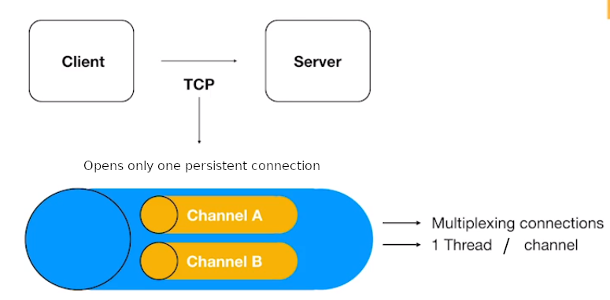
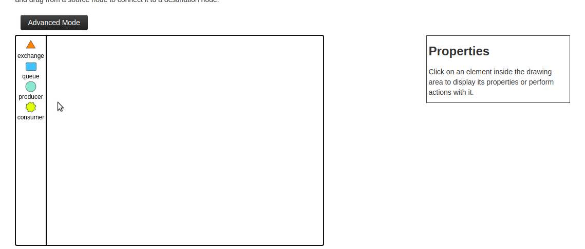
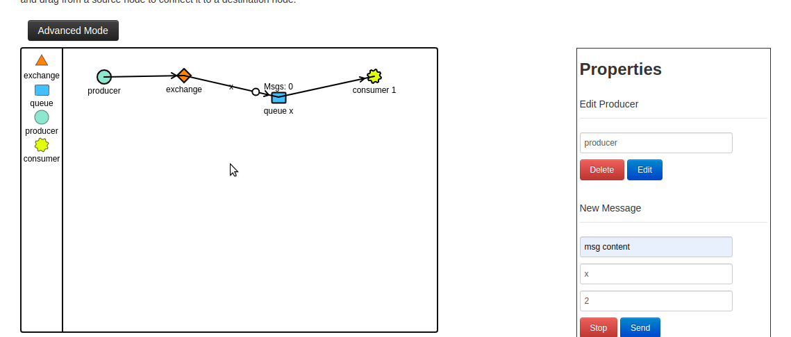
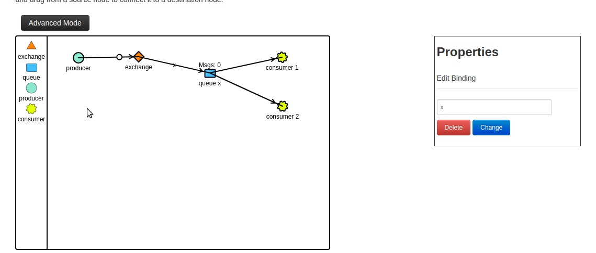

# full-cycle-2.0-rabbitmq

Files I produced during the RabbitMQ classes of my [Microservices Full Cycle 2.0 course](https://drive.google.com/file/d/1MdN-qK_8Pfg6YI3TSfSa5_2-FHmqGxEP/view?usp=sharing).

## RabbitMQ connections architecture

In RabbitMQ, you can use the same TCP connection to receive and send messages. To do that, you just need to use two different channels inside the same TCP connection.

## Examples using [RabbitMQ Simulator](http://tryrabbitmq.com/)

### 1 Producer, 1 Exchange, 1 Queue and 1 Consumer

### 1 Producer, 1 Exchange, 1 Queue and 2 Consumers

As both consumers are subscribed to the same queue, when one consumer get a message, the message is removed from the queue and the other consumer needs to wait for a new message to get it.

### 1 Producer, 1 Exchange, 2 Queues and 3 Consumers

Note that when I create the new queue and connect it to the exchange setting the routing key as y, when I change the producer routing key to y, the messages only go to the queue y.

